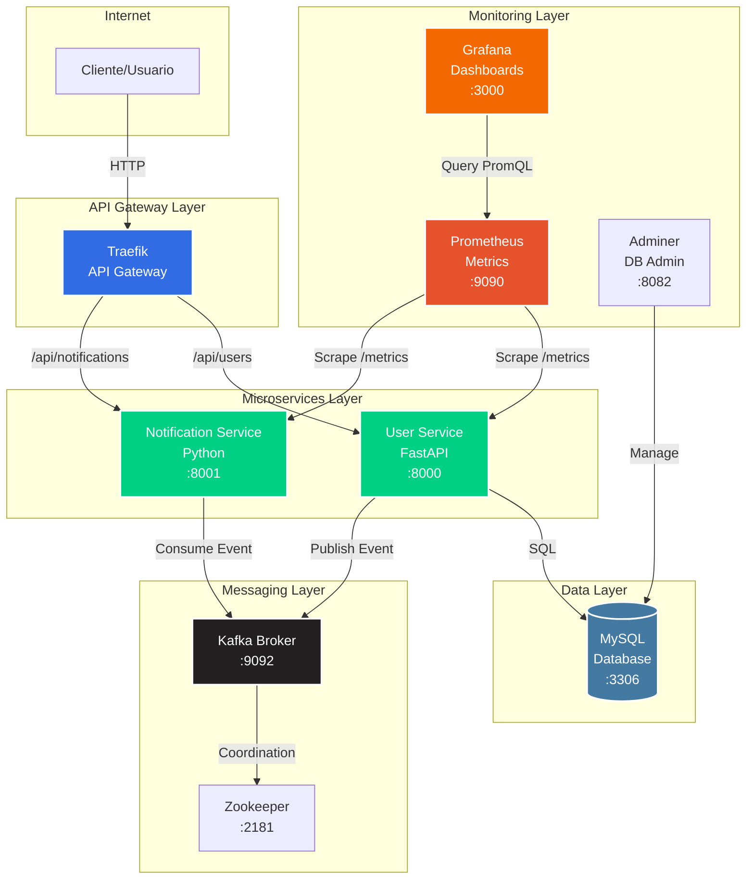

# Microservices Architecture - Cloud Computing Project

Arquitectura de microservicios con FastAPI, Kafka, Prometheus y Grafana. Proyecto desarrollado para el curso de Cloud Computing en la Universidad Autónoma de Occidente.

## Tabla de Contenidos

- [Arquitectura](#arquitectura)
- [Tecnologías](#tecnologías)
- [Requisitos Previos](#requisitos-previos)
- [Instalación Local (Docker Compose)](#instalación-local-docker-compose)
- [Despliegue en Kubernetes](#despliegue-en-kubernetes)
- [Uso](#uso)
- [Monitoreo](#monitoreo)
- [Imágenes Docker](#imágenes-docker)
- [Autor](#autor)

## Arquitectura



## Tecnologías

### Backend
- **Python 3.9**
- **FastAPI** - User Service REST API
- **SQLAlchemy** - ORM para MySQL
- **Kafka (Confluent)** - Message Broker

### Infraestructura
- **Docker & Docker Compose** - Contenedorización
- **Kubernetes (Minikube)** - Orquestación
- **Traefik** - API Gateway
- **MySQL 8.0** - Base de datos
- **Zookeeper** - Coordinación de Kafka

### Monitoreo
- **Prometheus** - Métricas
- **Grafana** - Visualización
- **Adminer** - Administración de BD

## Requisitos Previos

- Docker Desktop
- Docker Compose
- Python 3.9+
- Minikube (para Kubernetes)
- kubectl (para Kubernetes)
- 8GB RAM mínimo
- 20GB espacio en disco

## Instalación Local (Docker Compose)

### 1. Clonar el repositorio

```bash
git clone https://github.com/TU_USUARIO/microservices.git
cd microservices
```

### 2. Configurar variables de entorno

```bash
cp .env.dev .env
# Editar .env si es necesario
```

### 3. Levantar servicios

```bash
docker-compose up -d
```

### 4. Verificar estado

```bash
docker-compose ps
```

### 5. Acceder a los servicios

| Servicio | URL | Credenciales |
|----------|-----|--------------|
| User Service API | http://localhost:8000/docs | - |
| Grafana | http://localhost:3000 | admin / admin123 |
| Prometheus | http://localhost:9090 | - |
| Adminer | http://localhost:8082 | user: `user` / pass: `secret` |
| Traefik Dashboard | http://localhost:8080 | - |

## Despliegue en Kubernetes

### 1. Iniciar Minikube

```bash
minikube start --driver=docker --cpus=4 --memory=8192
minikube addons enable ingress
minikube addons enable dashboard
minikube addons enable metrics-server
```

### 2. Desplegar aplicación

```bash
cd k8s
./deploy.sh
```

### 3. Ver estado

```bash
kubectl get pods -n microservices
kubectl get svc -n microservices
```

### 4. Acceder a servicios

```bash
# Grafana
minikube service grafana -n microservices

# Prometheus
minikube service prometheus -n microservices

# User Service
minikube service user-service -n microservices
```

## Uso

### Registrar un usuario

```bash
curl -X POST http://localhost:8000/register/ \
  -H "Content-Type: application/json" \
  -d '{
    "user_name": "Juan Perez",
    "email": "juan@example.com"
  }'
```

### Ver métricas

```bash
# User Service
curl http://localhost:8000/metrics

# Notification Service
curl http://localhost:8001/metrics
```

### Ver eventos en Notification Service

```bash
docker logs notification-service -f
```

## Monitoreo

### Grafana Dashboard

El proyecto incluye un dashboard pre-configurado con los siguientes paneles:

- **Total Eventos Consumidos**: Contador de eventos procesados
- **Eventos por Minuto**: Rate de procesamiento
- **HTTP Requests Rate**: Requests por segundo
- **Uso de Memoria**: Consumo por servicio
- **CPU Usage**: Porcentaje de uso
- **Latencia Promedio**: Tiempo de respuesta

**Acceso:** http://localhost:3000  
**Usuario:** admin  
**Password:** admin123

### Prometheus Queries

```promql
# Total eventos
events_consumed_total

# Rate de eventos
rate(events_consumed_total[1m]) * 60

# Latencia
http_request_duration_seconds_sum / http_request_duration_seconds_count
```

## Imágenes Docker

Las imágenes están publicadas en Docker Hub:

- **User Service**: `julianandvalencia/user-service:latest`
- **Notification Service**: `julianandvalencia/notification-service:latest`

```bash
# Pull images
docker pull julianandvalencia/user-service:latest
docker pull julianandvalencia/notification-service:latest
```

## Testing

### Generar datos de prueba

```bash
# Crear script
chmod +x generate-test-data.sh

# Ejecutar
./generate-test-data.sh
```

## Estructura del Proyecto

```
microservices/
├── k8s/                    # Archivos Kubernetes
├── user_service/           # Microservicio de usuarios
├── notification_service/   # Microservicio de notificaciones
├── grafana/               # Configuración Grafana
├── docker-compose.yml     # Orquestación local
└── prometheus.yml         # Configuración Prometheus
```

## Detener servicios

### Docker Compose

```bash
docker-compose down
# Con volúmenes
docker-compose down -v
```

### Kubernetes

```bash
kubectl delete namespace microservices
# O detener Minikube
minikube stop
```

## Troubleshooting

### Ver logs

```bash
# Docker Compose
docker-compose logs -f user-service
docker-compose logs -f notification-service

# Kubernetes
kubectl logs -f deployment/user-service -n microservices
kubectl logs -f deployment/notification-service -n microservices
```

### Reiniciar servicios

```bash
# Docker Compose
docker-compose restart user-service

# Kubernetes
kubectl rollout restart deployment/user-service -n microservices
```

## Autor

**Julián Valencia - Jhon Caicedo**  
Universidad Autónoma de Occidente  
Cloud Computing - 2025

## Licencia

Este proyecto es parte de un trabajo académico.

## Referencias

- [FastAPI Documentation](https://fastapi.tiangolo.com/)
- [Apache Kafka](https://kafka.apache.org/)
- [Prometheus](https://prometheus.io/)
- [Grafana](https://grafana.com/)
- [Kubernetes](https://kubernetes.io/)
```